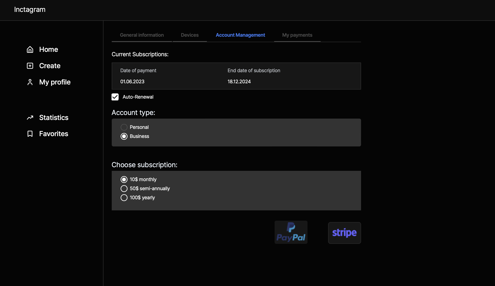

# The  Inct🍊gr🍊m  - copy of Instagram

## Description

**The Inct🍊gr🍊m** is a social network application built on the **NestJS** framework with a microservices architecture. 
It aims to replicate the functionality of Instagram, offering users a platform to create posts, stories, highlights, comments, likes, follow other users, engage in chats and messages, and purchase subscriptions.

The project is developed using TypeScript, adhering to **Domain-Driven Design** (DDD) and **Object-Oriented Programming** (OOP) principles to ensure maintainability and scalability.

## Features

- [User Registration and Authorization:](#user-registration-and-authorization)
Register and authorize users using traditional credentials with **JWT** and **Refresh Tokens**. 
Additionally, users can sign up and log in using **OAuth2.0** with **Google** and **Github**, as well as Recaptcha Enterprise for enhanced security.
- [Post Creation:](#post-creation)
Users can create posts by uploading photos along with descriptions to share their content with others.
- [Comments and Likes:](#comments-and-likes)
Users can engage with posts by commenting and liking them.
- [Subscriptions:](#subscriptions)
Users can purchase subscriptions to access premium features and exclusive content.
- [User Interactions:](#user-interactions)
Stay connected with other users by following their profiles and staying up to date with their activities.
- [Messaging:](#messaging)
Initiate private conversations by creating chats and exchanging messages with other users.
- [Stories and Highlights:](#stories-and-highlights)
Create temporary stories consisting of photos and descriptions. Users can also highlight their favorite stories for long-term display.
- [Story Interactions:](#story-interactions)
Like and comment on stories, as well as like and reply to comments.

## Technology Stack

- [**Framework:**](#framework)
  **NestJS** with a microservices architecture.
- [**Communication:**](#communication)
  **GraphQL** is used for efficient communication between the superAdmin and the server.
- [**Database:**](#database)
  **TypeORM** and **Prisma** handle database interactions following **DDD** and **OOP** design principles.
- [**Messaging:**](#messaging)
  **RabbitMQ** facilitates communication between microservices.
- [**Image Storage:**](#image-storage)
  **Amazon S3** is used to securely store user-uploaded photos.
- [**Documentation:**](#documentation)
  **Swagger** is integrated for comprehensive API documentation.
- [**Security:**](#security)
  **Recaptcha Enterprise** is used to ensure secure user registration and authorization.
- [**Testing:**](#testing)
  **Jest** is employed for testing the project, including **E2E tests**.
- [**Containerization:**](#containerization)
  **Docker** ensures easy deployment and scalability of the application.
- [**CI/CD:**](#cicd)
  **Github Actions** automates the continuous integration and continuous deployment processes.
- [**Storage:**](#storage)
  **Github Packages** serves as the repository for storing **Docker** images.

## Documentation
For detailed API documentation, please refer to the Swagger Documentation.

## App Screenshots

### Start the project

To start the project, get a local copy up and running follow these simple example steps.
- Clone the repository into your local machine
- Use `yarn` to install dependencies.
- Use `yarn start` to start project.
- Use `yarn test:e2e` to run e2e tests.

### Technologies Used

- **NestJS** 
- **TypeORM**   with **PostgreSQL** 
- **Prisma**  with **PostgreSQL** 
- **RabbitMQ** 
- **GraphQL** 
- **Swagger** 
- **Amazon S3**  
- **Typescript**   

#### External implementation of the following mentioned technologies is used in this project.

- **Recaptcha Enterprise** 
- **Google OAuth2.0** 
- **Github OAuth** 
- **Stripe** 
- **Paypal** 
